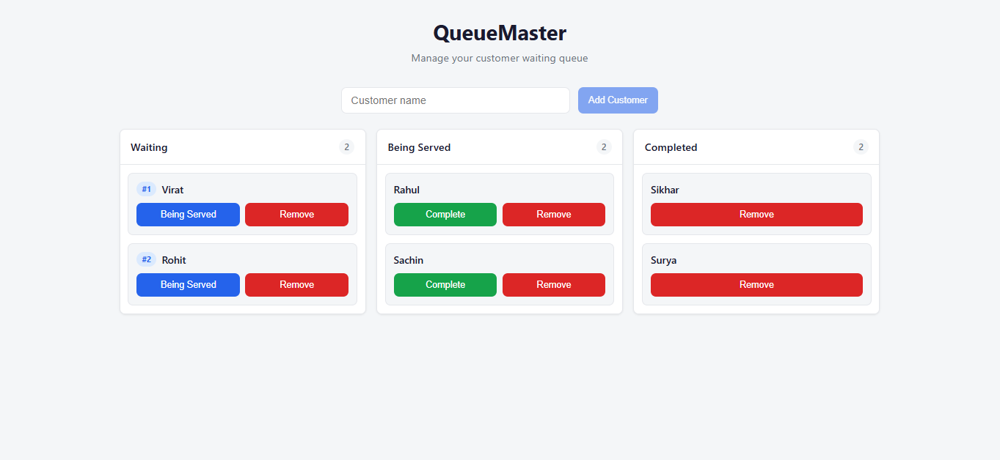

# QueueMaster

A simple web application for small businesses to manage a customer waiting queue.

## Project Overview

QueueMaster lets a business owner:

- Add customers to the queue
- Mark customers as **Being Served**
- Mark customers as **Completed**
- Remove customers from the queue
- View customers grouped by status (Waiting, Being Served, Completed)

**Tech stack:** React (Vite), Node.js (Express), MongoDB, Docker, Axios.

## Screenshot




## Architecture

The app runs as three Docker containers: **frontend** (React + Nginx), **backend** (Express REST API), and **mongodb** (database). The frontend talks to the backend via `/api`; in production, Nginx proxies those requests to the Express server.

Chose MongoDB over in-memory storage so the queue survives server restarts — relevant for a real business that might restart their system mid-day.

**Frontend:** React components + `useCustomers` hook for state, loading, and errors. Customers are grouped into three columns by status; the Waiting column shows queue position (#1, #2, …).

**Backend:** Layered Express app (routes → controllers → models) with validation middleware, centralized error handling, and enforced status transitions (`waiting` → `serving` → `completed` only).


```
queuemaster/
├── backend/
│   ├── config/           # Database connection
│   ├── controllers/      # Request handlers
│   ├── middleware/       # Validation, async handler, error handler
│   ├── models/           # Mongoose schemas
│   ├── routes/           # API route definitions
│   ├── app.js            # Express app setup
│   ├── server.js         # Entry point
│   ├── Dockerfile
│   └── package.json
├── frontend/
│   ├── src/
│   │   ├── api/          # Axios API client
│   │   ├── components/   # React UI components
│   │   ├── hooks/        # Custom hooks (useCustomers)
│   │   ├── App.jsx
│   │   ├── main.jsx
│   │   └── index.css
│   ├── index.html
│   ├── nginx.conf        # Production reverse proxy for /api
│   ├── Dockerfile
│   ├── vite.config.js
│   └── package.json
├── docker-compose.yml
├── screenshot.png
└── README.md
```

## Design Decisions

- **MongoDB over in-memory** — Queue data persists across restarts; a barber shop shouldn't lose its queue if the server restarts mid-day
- **Server-side transition enforcement** — Status rules (waiting → serving → completed) are enforced on the backend, not just the UI, so the API is safe to use directly
- **Nginx reverse proxy** — Single port (3000) for the frontend in production; no CORS issues, cleaner setup
- **PATCH over PUT for status** — Only the status field changes, so PATCH is semantically correct over a full PUT replace
- **409 over 400 for invalid transitions** — 400 means bad request format; 409 Conflict is the correct HTTP code when the request is valid but conflicts with current state

## API Documentation

Base URL (local dev): `http://localhost:5000/api`  
Base URL (Docker): `http://localhost:3000/api` (proxied via Nginx)

### Health Check

| Method | Endpoint       | Description  | Status |
|--------|----------------|--------------|--------|
| GET    | `/api/health`  | Server health | 200   |

### Customers

| Method | Endpoint                    | Body                          | Description              | Status Codes   |
|--------|-----------------------------|-------------------------------|--------------------------|----------------|
| GET    | `/api/customers`            | —                             | List all customers       | 200            |
| POST   | `/api/customers`            | `{ "name": "John" }`          | Add customer (waiting)   | 201, 400       |
| PATCH  | `/api/customers/:id/status` | `{ "status": "serving" }`     | Update customer status   | 200, 400, 404, 409 |
| DELETE | `/api/customers/:id`        | —                             | Remove customer          | 200, 404       |

**Status values:** `waiting`, `serving`, `completed`

**Allowed transitions:** `waiting` → `serving` → `completed` only (invalid transitions return **409 Conflict**)

**Response shape (all endpoints):**

Success:
```json
{ "success": true, "data": { ... } }
```

Error:
```json
{ "success": false, "error": "Error message" }
```

**Customer data shape (inside `data`):**

```json
{
  "id": "665f1a2b3c4d5e6f7a8b9c0d",
  "name": "John",
  "status": "waiting",
  "createdAt": "2025-06-29T10:00:00.000Z"
}
```

**Name validation (POST):**

| Case | Error message |
|------|---------------|
| Missing or empty | `Customer name is required` |
| Whitespace only | `Customer name cannot be whitespace only` |
| Over 50 characters | `Customer name cannot exceed 50 characters` |

Names are trimmed before saving.

**Status transition errors (PATCH):** Invalid transitions return **409** with `{ "success": false, "error": "Invalid status transition" }`.

## Assumptions

| Topic | Assumption |
|-------|------------|
| Database | MongoDB over in-memory — queue data persists across server/container restarts |
| Duplicate names | Allowed — same name can appear multiple times |
| Status transitions | Only `waiting` → `serving` → `completed`; enforced server-side (409 on invalid) |
| Completed → waiting | Not allowed — add a new customer instead |
| Queue order | FIFO within each status group, sorted by `createdAt` |
| Queue positions | Shown in the Waiting column (#1, #2, …) based on join order |
| Multiple serving | Allowed — multiple customers can be served at once |
| Authentication | None — single business owner, trusted environment |
| Empty queue | UI shows "No customers" in each column |
| Loading / errors | Buttons disabled during API calls; errors shown in a dismissible banner |

## Prerequisites

- **Docker (recommended):** Docker Desktop + Docker Compose
- **Local development:** Node.js 20+, npm, MongoDB 7+

## Setup Instructions

### Option 1: Docker (Recommended)

1. Clone the repository:

   ```bash
   git clone https://github.com/Hariom-Jangir/queuemaster
   cd queuemaster
   ```

2. Build and start all services:

   ```bash
   docker compose up --build
   ```

3. Open the application:

   - **Frontend:** http://localhost:3000
   - **Backend API:** http://localhost:5000/api
   - **Health check:** http://localhost:5000/api/health

4. Stop services:

   ```bash
   docker compose down
   ```

### Option 2: Local Development

**Terminal 1 — MongoDB**

Ensure MongoDB is running on `mongodb://localhost:27017`.

**Terminal 2 — Backend**

```bash
cd backend
npm install
cp .env.example .env
npm run dev
```

**Terminal 3 — Frontend**

```bash
cd frontend
npm install
cp .env.example .env
npm run dev
```

Open http://localhost:5173 — the Vite dev server proxies `/api` requests to the backend.

## Docker Commands

| Command | Description |
|---------|-------------|
| `docker compose up --build` | Build and start all containers |
| `docker compose up -d` | Start in detached (background) mode |
| `docker compose down` | Stop and remove containers |
| `docker compose down -v` | Stop and remove containers + volumes |
| `docker compose logs -f` | Follow logs from all services |
| `docker compose logs -f backend` | Follow backend logs only |
| `docker compose ps` | List running containers |

### Build Individual Containers

```bash
# Backend only
docker build -t queuemaster-backend ./backend

# Frontend only
docker build -t queuemaster-frontend ./frontend
```

### Run Individual Containers

```bash
# Backend (requires MongoDB running)
docker run -p 5000:5000 \
  -e MONGODB_URI=mongodb://host.docker.internal:27017/queuemaster \
  queuemaster-backend

# Frontend (requires backend reachable as "backend" hostname or update nginx.conf)
docker run -p 3000:80 queuemaster-frontend

> Note: For a fully self-contained setup, use Option 1 (Docker Compose) — 
> it includes MongoDB automatically. Running containers individually 
> requires MongoDB already running locally on port 27017.

```

## Environment Variables

### Backend (`backend/.env`)

| Variable       | Default                              | Description                    |
|----------------|--------------------------------------|--------------------------------|
| `PORT`         | `5000`                               | Server port                    |
| `MONGODB_URI`  | `mongodb://localhost:27017/queuemaster` | MongoDB connection string  |
| `FRONTEND_URL` | `http://localhost:5173`              | Allowed CORS origin            |

### Frontend (`frontend/.env`)

| Variable        | Default | Description                          |
|-----------------|---------|--------------------------------------|
| `VITE_API_URL`  | `/api`  | API base URL (relative in Docker)    |

### Docker Compose (set in `docker-compose.yml`)

| Service  | Variable       | Value                                  |
|----------|----------------|----------------------------------------|
| backend  | `MONGODB_URI`  | `mongodb://mongodb:27017/queuemaster`  |
| backend  | `FRONTEND_URL` | `http://localhost:3000`                |
| frontend | `VITE_API_URL` | `/api` (baked in at build time)        |

## If I Had 3 More Hours

- **Unit & integration tests** — Jest/Vitest for API and React components
- **Optimistic UI updates** — Faster perceived performance on button clicks
- **WebSocket / SSE** — Real-time queue updates across multiple devices
- **Input debouncing & toast notifications** — Better UX feedback
- **CI/CD pipeline** — GitHub Actions for lint, test, and Docker build
- **Single-serving mode** — Optional setting to allow only one customer being served
- **Customer search & filtering** — Find customers quickly in a long queue

## Compromises (1-Hour Time Limit)

- **No authentication** — Kept scope minimal per assignment requirements
- **No automated tests** — Prioritized working end-to-end flow
- **Minimal styling** — Clean but not heavily designed UI
- **No pagination** — Suitable for small queues only
- **No data export or history** — Completed customers stay visible until removed

## License

ISC
